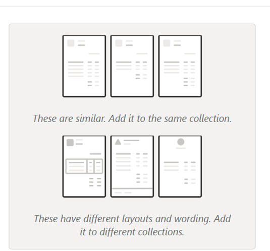

#Agregação das Faturas por Coleções

Para treinar o modelo é necessário agregar as faturas em coleções. As coleções servem como pastas de ficheiros dentro do AI Builder.

1. Cada coleção deve ter no mínimo 5 documentos (.JPG, .PNG ou .PDF);

2. Os documentos em cada coleção devem ter layouts muito semelhantes para que o modelo consiga extrair a mesma informação;

3. Cada coleção deve ter no máximo 50 MB e 500 páginas no total;

