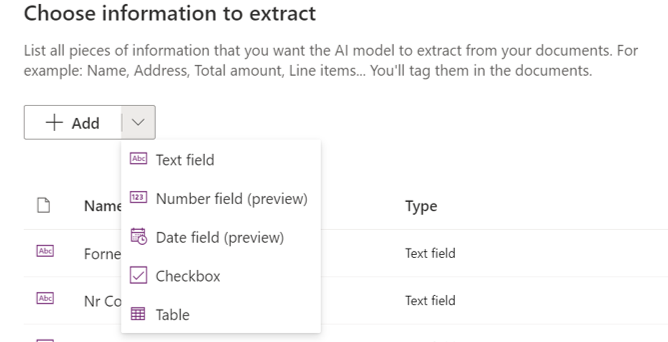

# Criação de Parâmetros

Nesta fase deve adicionar-se à lista de campos os parâmetros que se pretendem utilizar, da seguinte forma: 

- Escolher o tipo de parâmetro e nome;
- Caso seja um número ou uma data é necessário selecionar o formato como vai ser apresentado;
- Caso seja uma tabela é necessário criar parâmetros para cada coluna, a ordem dos parâmetros não tem importância;
- É possível adicionar mais parâmetros depois do modelo ser treinado.

---

