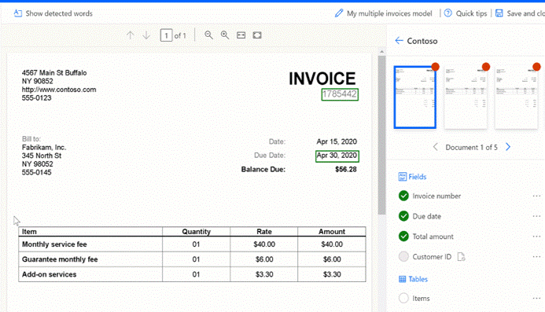

#Seleção de Parâmetros

De forma a treinar o modelo é necessário selecionar e identificar os parâmetros criados em todos os documentos.

Para identificar a informação a extrair, desenha-se um retângulo à volta da informação de interesse e atribui-se ao campo ou tabela correspondente.

---

Se um campo ou tabela não estiver presente num dos documentos, clique no ícone dos três pontos para obter mais opções e seleccione “Not available in document” (não consta no documento), ou no caso de não estar disponível na coleção “Not available in collection” (não disponível na coleção).

---

##Seleção de Parâmetros - Tabelas

1. Seleciona-se a tabela inteira, tal como nos outros parâmetros;
2. Para desenhar linhas, clique com o botão esquerdo do rato entre os separadores de linhas;
3. Para desenhar colunas, prima Ctrl + clique com o botão esquerdo do rato;
4. Atribua os parâmetros a extrair selecionando o cabeçalho da coluna e atribuindo o parâmetro;
5. Se o cabeçalho da tabela tiver sido marcado, selecione “Ignore first row” para que o cabeçalho da tabela não seja extraído como o conteúdo da tabela.

---

---

##Seleção de Parâmetros – Tabelas "Advanced Tagging Mode"
​
Este modo de seleção serve para tabelas que estão distorcidas, onde a marcação com uma grelha não é possível. Como por exemplo  quando é necessário extrair  mais de um item dentro de uma célula.​
​
Facilita o trabalho se começar por selecionar o modo predefinido para capturar rapidamente todas as linhas e colunas. Em seguida, mudar para o modo avançado para ajustar cada célula.

---
