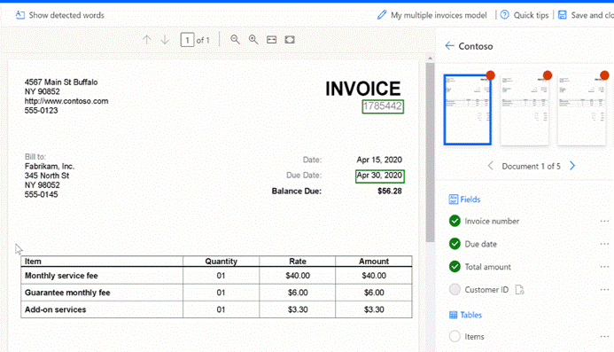

#Seleção de Parâmetros - Tabelas

1. Seleciona-se a tabela inteira, tal como nos outros parâmetros;
2. Para desenhar linhas, clique com o botão esquerdo do rato entre os separadores de linhas;
3. Para desenhar colunas, prima Ctrl + clique com o botão esquerdo do rato;
4. Atribua os parâmetros a extrair selecionando o cabeçalho da coluna e atribuindo o parâmetro;
5. Se o cabeçalho da tabela tiver sido marcado, selecione “Ignore first row” para que o cabeçalho da tabela não seja extraído como o conteúdo da tabela.

---

