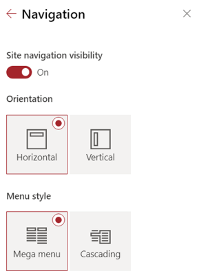

# 3 - Criação de novo ano de arquivo

Para a criação de um novo registo na tabela de Anos, é necessário preencher os dados na lista “Ano Fiscal”, no site principal (Sistema de Registo Documental - Grupo FHC - Hub - Ano Fiscal - All Items (sharepoint.com))

É necessário termos a seguinte informação:

- Ano;
- Selecionar a Empresa da Lista de Empresas existente;
- Link do Site a criar, onde ficarão alojados os documentos do respetivo ano;

---

## 3.1 Cofigurar as Bibliotecas de Documentos
Após a execução do processo de criação do site do novo ano, é necessário configurar as bibliotecas de documentos, para colocar o “Content Type” e os campos corretos na “View”.

### 3.1.1 Configurar o "Content Type"
Deste modo, devemos atribuir a cada uma das “Document Libraries” o "Content Type" - FHC Digi Documents CT. Indo a cada uma das Bibliotecas de Documentos e executando os seguintes passos:

1. Selecionar “Library Settings”;
2. No bloco "Content Type", selecionar a opção “Add from existing site content types”;
3. Selecionar o tipo FHC Digi Documents CT da lista de "Content Type";
4. Clicar em "OK".

 O novo tipo criado aparecerá na lista de "Content Type", na Biblioteca de Documentos. 
 
 Falta ainda configurar o Content Type como "Default", sendo para isso necessário fazer as seguintes ações:

- Seleccionar a opção “Change new button order and default content type”;
- Tornar o "Content Type Document" não visível, fazendo um click na respetiva opção; 
 - Colocar o "Content Type" FHC Digi Documents CT em primeiro lugar na lista.

### 3.1.2 Configurar os campos na "View"
Depois de se executar a tarefa anterior, é necessário configurar os campos na “View” para que estejam visíveis:

- No bloco “Views”, é necessário seleccionar “All Documents” para colocarmos os campos novos.
- Escolher os campos, de acordo com a imagem em baixo, colocando-os na ordem correta.
- Caso não fiquem na ordem indicada, no interface de visualização, os campos podem ser arrastados de forma a ficarem na posição pretendida.

De seguida, é necessário configurar o número de items que serão visualizados (por defeito 30) e alterar para 300. Para isso, temos que ir ao bloco “Item Limit” e colocar o valor em 300, tal como está na imagem. Carregamos no "OK" e temos a nossa Biblioteca de Documentos perfeitamente configurada.

---

##3.2 Costumizar o site do novo ano criado

Para terminar o processo, falta customizar o site do novo ano recentemente criado. Temos como exemplo o que foi feito para o site da Empresa, onde é necessário customizar tanto a Navegação quanto o Menu, bem como a informação da página Inicial.

1. Para customizar o Menu, tal como já foi referido anteriormente, o que tem que ser feito é, clicar na roda dentada do canto superior direito e aceder aos “Settings” do site, selecionado depois a opção “Change the Look”.
2. Clicar na opção “Navigation” e escolher as opções “Horizontal” e “Mega Menu”, como aparece na imagem do lado
3. Falta apenas remover do Menu as opções que não pretendemos, deixando apenas o “Home” e o “Site Contents” (por defeito é colocado o “Recycle Bin”).

### 3.2.1 Costumizar a "Home Page"
Para customizarmos a página inicial (“Home Page”) do site recém-criado , temos que clicar no botão “Edit” da página para remover todas as “webParts” que estão por defeito na página.

- Para eliminar as "webparts", deve clicar na zona da página. Do lado esquerdo vai surgir um menu com os 4 icons. Só tem que clicar no icon do “Caixote do Lixo” para eliminar tudo. A partir de agora temos as condições para colocar a webpart que pretendemos.

-  Para adicionar a "webpart" pretendida (Document Library), temos que clicar no sinal (X) que aparece no centro da página e depois disso, clicar no icon da  "Document Library".

- Depois disso, só teremos que escolher a biblioteca de document FTR – Fatura para que a nossa página esteja completa

- Por fim, apenas temos que clicar no botão Republish, no canto superior direito da nossa página, para a publicar.

