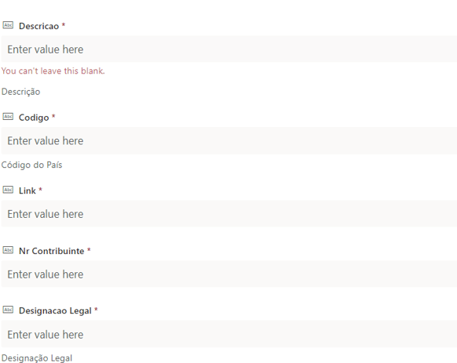
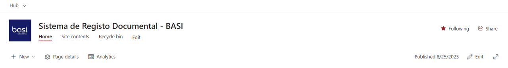

#Criação de nova Empresa

Para a criação de uma nova empresa, é necessário preencher os dados na lista “Empresas do Grupo” no site principal (Sistema de Registo Documental - Grupo FHC - Hub - Home (sharepoint.com)). Para isso é necessário termos a seguinte informação:

- Nome abreviado da Empresa (Descrição);
- Código da Empresa – Código de 3 posições que  vai definir a empresa. (Ex. EMP – Empifarma);
- Link do Site a ser criado;
- Número de Contribuinte da Empresa;
- Designação legal da Empresa;

(* Todos os campos são de preenchimento obrigatório)

---

Depois de preenchido o registo na tabela, há um processo que executa a criação de uma nova “Site Collection” e que o agrega ao “Site Hub”. Agora há a necessidade de o customizar.
Da customização faz parte a alteração do tipo de Menu, a colocação do logótipo da empresa, bem como a remoção de umas entradas no menu. 

## <strong>Customização do Menu: </strong>

Na roda dentada (“Site Settings”) selecionar a opção “Change the Look” e depois dentro da opção “Header” fazer o upload dos logótipos da empresa. 
De seguida, temos que customizar a navegação e para isso, clicamos em “Navigation” e escolhemos “Horizontal” e em baixo selecionamos o “Mega Menu”. 
Falta apenas remover do Menu as opções que não pretendemos, deixando apenas o “Home” e o “Site Contents” (por defeito é colocado o “Recycle Bin”).

